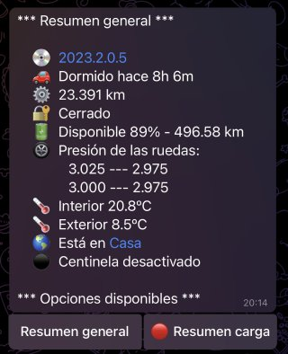
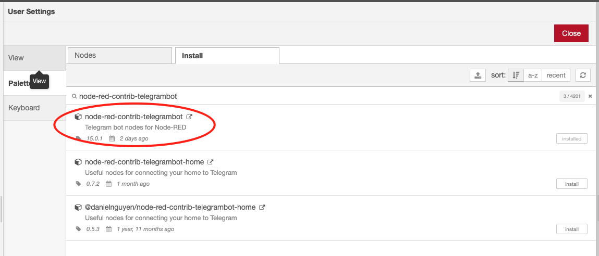
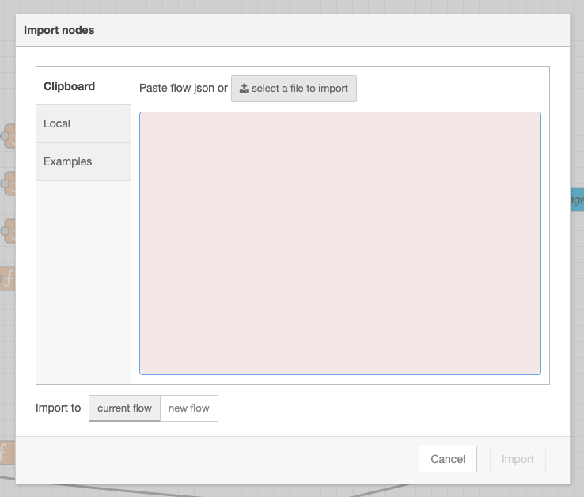
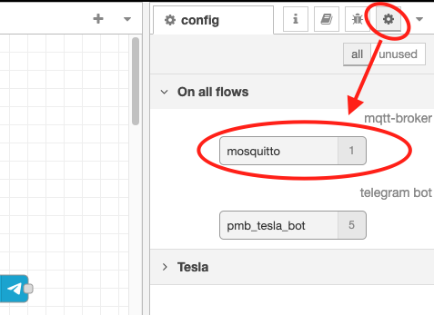
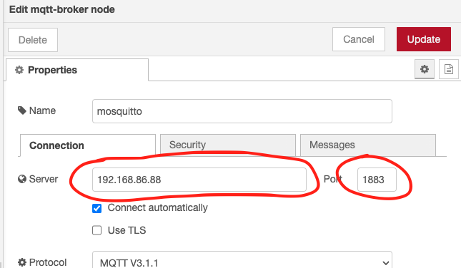
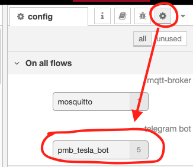
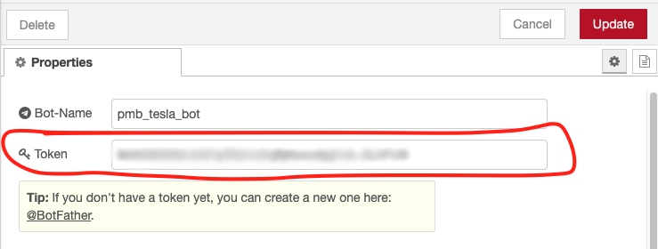
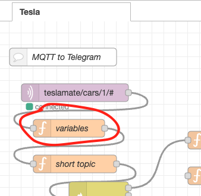
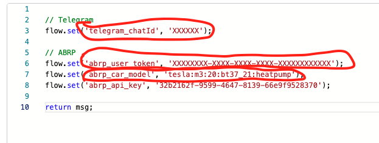

# Node-Red: Sync Teslamate with Telegram and ABRP


[](https://www.paypal.com/donate?hosted_button_id=QF2MBMQZP4V2J)



---

## Instalación

Para el correcto funcionamiento del Flow tienes que tener los siguientes módulos instalados.

```bash 
node-red-contrib-telegrambot
```

### ¿Cómo instalo el módulo requerido?

Dentro de Node-Red pincha sobre la hamburguesa situada arriba a la derecha, en el menú que se te despliega, selecciona `Manage Palette`.

Se abrirá una nueva pantalla, en ella seleccionamos la opción `Palette` en el menú de la izquierda sino está seleccionada ya y a continuación en el menú superior seleccionamos `Install`.

Ahora en el cuadro de búsqueda, introducir el nombre del módulo necesario. Hay que fijarse bien porque aparecerán varios resultados.



Una vez instalado el módulo nos pedirá reiniciar completamente Node-Red.

### Importar el Flow

Dentro de Node-Red pincha sobre la hamburguesa situada arriba a la derecha, en el menú que se te despliega, selecciona `Import`.



Se abrirá una nueva pantalla, en ella seleccionamos la opción `select a file to import`, ahora tendremos que buscar el archivo `tesla.json` que se encuentra dentro del directorio "flows". Tras esto pinchamos sobre `Import`.

Una vez importado, tendrás que proceder a configurar MQTT, Telegram y ABRP.

### Configurar nodo de MQTT

Dentro de Node-Red pinchamos en el icono con forma de rueda dentada. Al pincharlo se nos despliega un listado de nodos, tenemos que hacer doble clic sobre el que se llama `mosquitto`.



En la nueva ventana que se nos abre, tenemos que ajustar los valores `Server` y `Port` correspondientes a nuestro servidor MQTT. Por defecto, el puerto es el 1883.



Una vez configurados, pulsamos sobre **Update**.

### Configurar nodo de Telegram

Dentro de Node-Red pinchamos en el icono con forma de rueda dentada. Al pincharlo se nos despliega un listado de nodos, tenemos que hacer doble clic sobre el que se llama `pmb_tesla_bot`.



En la nueva ventana que se nos abre, tenemos que ajustar el valor del campo `Token`.



Una vez configurados, pulsamos sobre **Update**.

### Configurar ABRP y Telegram

Por último queda configurar la conexión con ABRP y el chatID de Telegram para una mayor seguridad.

Dentro del flow propiamente dicho, buscamos la función llamada `variables` en el apartado `MQTT to Telegram`.



Haciendo doble clic sobre él se nos abrirá una nueva ventana de texto. Ahora deberémos cambiar los valores de las variables `telegram_chatId`, `abrp_user_token` y `abrp_car_model`. La variable `abrp_api_key` se puede quedar con el valor que tiene.



## ¿Me invitas a un café?

Si te gusta mi trabajo y quieres apoyarme, puedes invitarme a un café ☕️, ¡te lo agradeceré mucho!

Tu apoyo es importante para seguir mejorando este tipo de contenidos.

¡Gracias!

[](https://www.paypal.com/donate?hosted_button_id=QF2MBMQZP4V2J)

## Créditos

- Autor: Carlos Cuezva

## Licencia

Distribuido bajo [licencia MIT](./LICENSE)